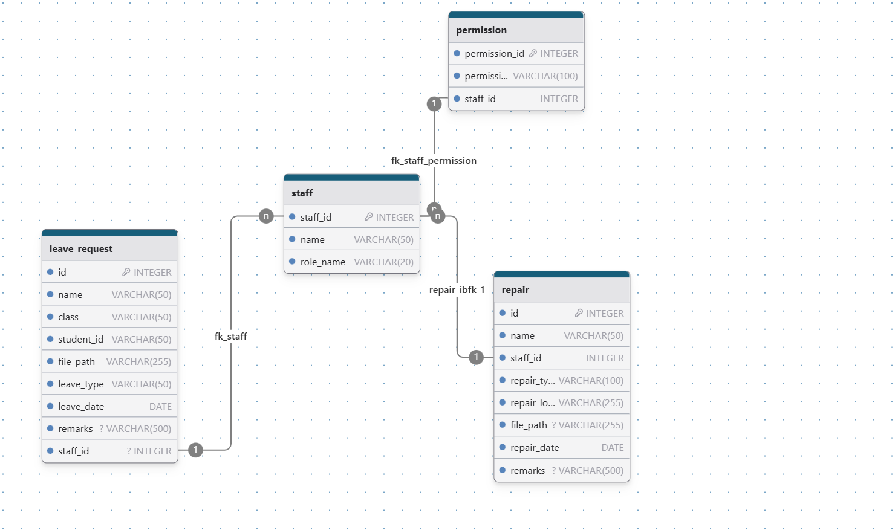

# 开发文档
## 项目结构
```
|-java
    |-com.changping.backend
        |-config
            |-handler
        |-controller (Presentation Layer)
        |-service (Business Logic Layer)
        |-DTO (BLL)
        |-entity (Data Access Layer)
        |-jwt
            |-dto
            |-filter
            |-util
        |-repository (DAL)
|-resources
```
## 功能需求
### admins' authority
1. 分配staff的职业
2. 查看所有表单
### teachers' authority
1. 提交请假、报修、反馈表单 | POST
2. 查看自己提交的表单 | GET
### guards' authority
1. 提交报修、反馈表单 | POST
2. 查看请假表单、自己提交的表单 | GET
### repairmen' s authority
1. 提交反馈表单 | POST
2. 查看报修表单、自己提交的表单 | GET
### permission
1. 通过字符串比较判断，

## 数据库结构
### 权限数据库(permission)
### 报修数据库(repair)
### 请假数据库(leave_request)
### 巡逻打卡数据库(存储二维码信息)
{"id": int, <br>
"location": varchar<br>
}



## 权限管理逻辑
### login/register
1. com/changping/backend/jwt/JwtUtil: 工具类，负责生成token,验证token
2. login逻辑：~~每个staff密码构成应该为其staffId+校名首字母大写，确保其唯一性，
因为我在编写token逻辑时将name作为判别条件导致的错误方向，一时间很难全部修正，所以先暂定此方法。~~（已修正）<br>
将staffId作为token构成，前端可解析token获取用户Id返回给后端进行相关查询业务