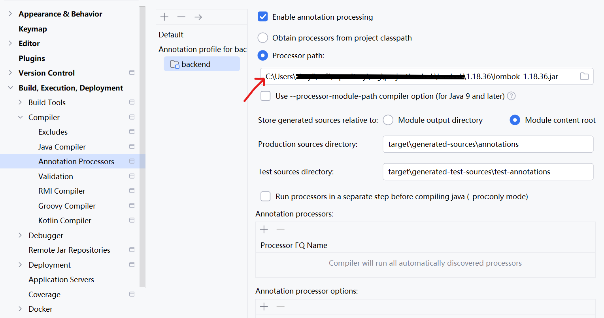

## @Data无法被识别
settings -> Build, Execution, Deployment -> Compiler 
-> Annotation Processors -> click your project -> fix the processor path

## JpaRepository自动生成查询方法的命名问题
Only accept **camelCase**, and the name should as same as the field in your Entity Class

## /login 无法正常访问的问题